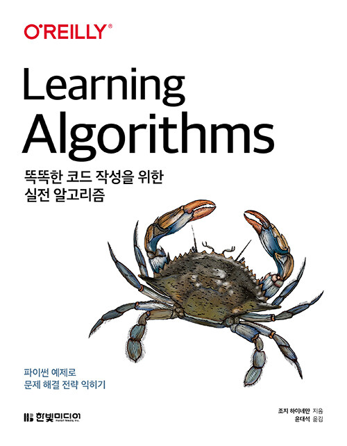

# 똑똑한 코드 작성을 위한 실전 알고리즘

`Algorithm` `Data structure` `Python`

## 개요

이 저장소는 **똑똑한 코드 작성을 위한 실전 알고리즘**의 학습 내용이 정리되어 있습니다.

> 조지 하이네만

## 학습 목표
- 알고리듬 숙달

### 학습 내용
|No|목차|핵심 학습 내용|
|---|---|---|
|01|[문제 해결]()||
|02|[알고리즘 분석]()||
|03|[해싱]()||
|04|[힙]()||
|05|[정렬]()||
|06|[이진 트리]()||
|07|[그래프]()||
|08|[정리]()||

## 참고 자료
[공개 코드](https://github.com/heineman/LearningAlgorithms)
